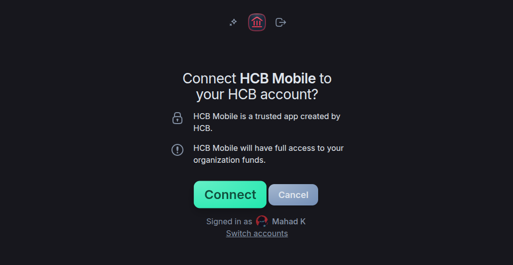

# HCB API proxy

## Initial setup

This will take about 10-15 minutes.

To install dependencies:

```bash
bun install
```

Fill in the `.env`:

```
HCB_CLIENT_ID="yt8JHmPDmmYYLUmoEiGtocYwg5fSOGCrcIY3G-vkMRs" # HCB Mobile
MASTER_KEY="..." # cat /dev/urandom | head -30 | sha256sum
```

To run:

```bash
bun .
```

Visit `localhost:3000` (or whatever the domain is) and sign in with the master key.


Then, click [here](https://hcb.hackclub.com/api/v4/oauth/authorize?client_id=yt8JHmPDmmYYLUmoEiGtocYwg5fSOGCrcIY3G-vkMRs&redirect_uri=hcb%3A%2F%2F&response_type=code&scope=read%20write) to visit HCB Mobile's authorization page.



Open DevTools with `Ctrl+Shift+I`/`Cmd+Shift+I` and navigate to the Network tab.

Then, click the "Authorize" button on the page. You will see an `authorize` request in the Network tab - click into it and scroll down to the `Location` response header. It should look like this:

```
hcb://?code=pnbZE22FDA-cd919de5cd0d71b0121a6ac
```

Copy the `code` parameter and paste it into the UI. The page should hopefully look like this:


Tokens are refreshed every two hours automatically.
