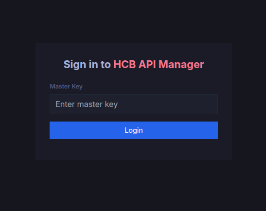

# HCB API proxy

A super easy way to use the [HCB v4 API](https://hcb-developers.anscg.net/api-reference/), even if you are not a member of HQ. Normally, you'd have to get a member of the HCB engineering team to create an OAuth app for you, but OAuth apps are HQ-only and can be annoying to use.

HCB-API handles things like token refreshes and code exchanges for you, so you don't have to worry about things like access tokens expiring. In other words, HCB-API makes v4 authentication much simpler.

Once it's set up, it's very similar to using the standard v4 API, except you simply use the HCB-API domain instead of `hcb.hackclub.com`. For example, if you want to use the `https://hcb.hackclub.com/api/v4/user/card_grants` endpoint, do something like this:

```bash
curl https://your_hcb_api_domain.com/api/v4/user/card_grants \
  --header 'Authorization: Bearer YOUR_MASTER_KEY'
```

## Initial setup

This will take about 10-15 minutes.

First, install dependencies:

```bash
bun install
```

Fill in the `.env`:

```
HCB_CLIENT_ID="yt8JHmPDmmYYLUmoEiGtocYwg5fSOGCrcIY3G-vkMRs" # HCB Mobile
MASTER_KEY="..." # cat /dev/urandom | head -30 | sha256sum
NODE_ENV=production
```

To run:

```bash
bun .
```

Visit `localhost:3000` (or whatever the domain is) and sign in with the master key.



Then, click the "Use setup wizard" button to connect HCB-API with your HCB account.

The dashboard should hopefully look like this:


If you reached this stage, you're done! You can now call the HCB API with the proxy. (See above)