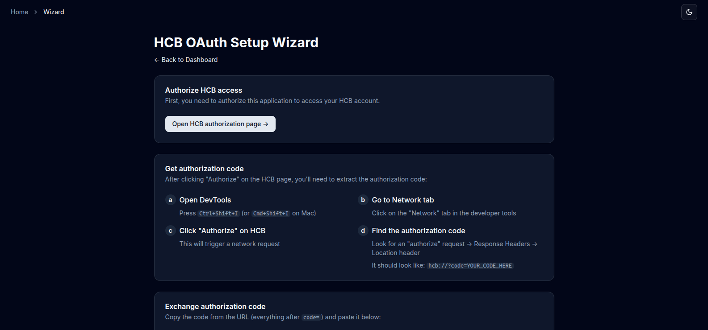
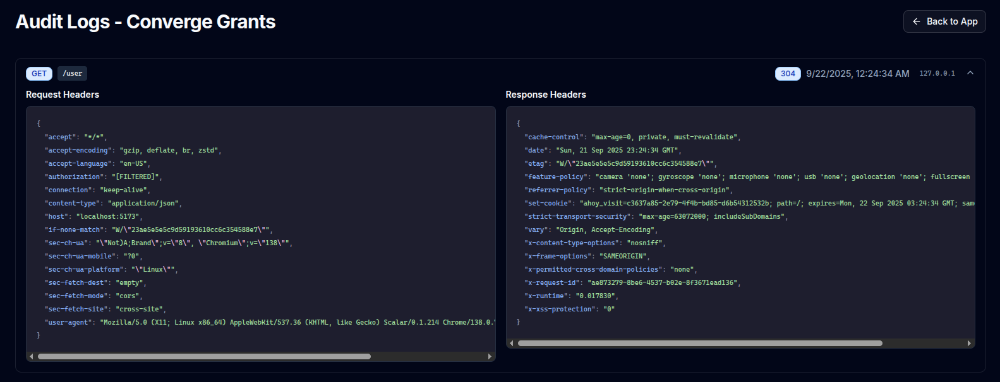

# HCB API proxy

A super easy way to use the [HCB v4 API](https://hcb-developers.anscg.net/api-reference/), even if you are not a member of HQ. Normally, you'd have to get a member of the HCB engineering team to create an OAuth app for you, but OAuth apps are HQ-only and can be annoying to use.

HCB-API handles things like token refreshes and code exchanges for you, so you don't have to worry about things like access tokens expiring. In other words, HCB-API makes v4 authentication much simpler.

Once it's set up, it's very similar to using the standard v4 API, except you simply use the HCB-API domain instead of `hcb.hackclub.com`. For example, if you want to use the `https://hcb.hackclub.com/api/v4/user/card_grants` endpoint, do something like this:

```bash
curl https://your_hcb_api_domain.com/api/v4/user/card_grants \
  --header 'Authorization: Bearer YOUR_API_KEY'
```

> [!WARNING]
> **Important: your responsibilities when using HCB-API**
>
> Please read this text carefully in order to understand what you are getting into.
>
> HCB-API is unofficial software, and HCB's v4 API itself is still in development.
>
> If you encounter issues with the API, you are more likely to get support if you open an issue on this repository or send me a message on Slack.
>
> Please ensure you have robust monitoring and error handling when using the API (this goes for the official API too!) to ensure you do not lose money, especially if you are performing money movement (by e.g. issuing grants) - we highly recommend using the idempotency key feature for this. This software is provided as-is, without any warranties. The authors aren’t responsible for any issues, damages, or claims that may arise from its use. As such, it's your job to know what you're doing.

With that out of the way, let's get started!

## Initial setup

### Getting the application running

#### Via Docker Compose (recommended)

This will handle things like storage for you.

```
git clone https://github.com/skyfallWasTaken/hcb-api && cd hcb-api
docker compose up
```

Then visit `localhost:3000`.

#### Manual setup

This will take about 10-15 minutes.

First, install dependencies:

```bash
bun install
```

Fill in the `.env`:

```
HCB_CLIENT_ID="yt8JHmPDmmYYLUmoEiGtocYwg5fSOGCrcIY3G-vkMRs" # HCB Mobile
DATABASE_URL=<sqlite database URL>
NODE_ENV=production
```

To run:

```bash
bun .
```

Visit `localhost:5173` (or whatever the domain is).

### Configuring HCB-API

Click the "Set up OAuth" button to connect HCB-API with your HCB account.



The dashboard should hopefully look like this:


Then, create a new application and copy the API key. You're now done! (see above for instructions.)

If you want to send grants or view card information, toggle the "Enable money movement" or "Enable accessing cards" settings.

## Audit logs

HCB-API has audit logs, which allows you to see what's happening with your account.



## API Docs

Unofficial API docs are available [here.](https://hcb-developers.anscg.net/api-reference/) For the most up to date information, it's best to read the HCB codebase (using AI agents for this can be very helpful, but as the scare text says above, it's your job to know what you're doing is correct.)
